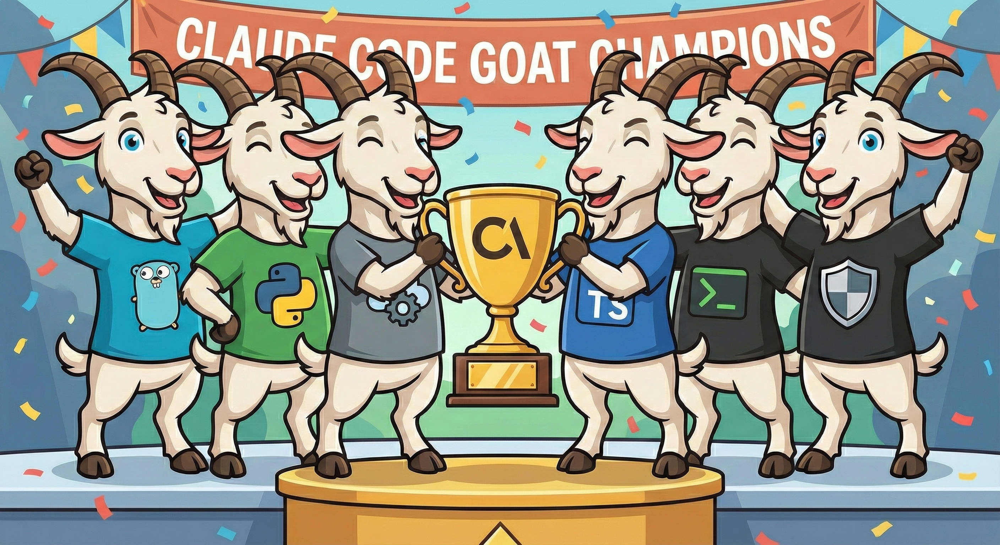

# claude-goat 🐐



claude-goat is a curated library of highly optimized agent configurations ('GOATs') designed to enhance your agentic coding workflow. Whether you are using Claude Code, Cursor, or Antigravity, these specialized prompt sets help standardize agent behavior, improve code quality, and align AI assistance with best practices across various languages and domains.

## What this repo is

- **A Claude Code plugin marketplace** that lets you install individual GOAT agents (one per plugin) from the Claude Code UI/terminal.
- **A human-friendly folder structure** so you can also copy/paste agents into other tools (Cursor, Antigravity, Gemini CLI).

## Marketplace Structure

```text
claude-goat/
├── .claude-plugin/
│   └── marketplace.json          # Marketplace registry
├── plugins/                       # Installable plugins
│   ├── goat-bash/
│   ├── goat-git/
│   ├── goat-github/
│   ├── goat-go-programmer/
│   ├── goat-python/
│   ├── goat-security-reviewer/
│   ├── goat-sre/
│   ├── goat-team-leader/
│   └── goat-typescript/
└── agents/                        # Manual install configs
    └── management/
        └── goat-team-leader/
```

## Available GOAT Agents

| Agent                      | Purpose                        | Key Capabilities                                                                                           | When to Use                                                           |
| -------------------------- | ------------------------------ | ---------------------------------------------------------------------------------------------------------- | --------------------------------------------------------------------- |
| **goat-bash**              | Safe, operable shell scripting | POSIX-compliant scripts, safe defaults (`set -euo pipefail`), idempotent operations, proper error handling | Automating workflows, deployment scripts, system administration tasks |
| **goat-git**               | Safe history & clean diffs     | Clean commit history, safe rebasing, conflict resolution, reflog recovery                                  | Managing version control, code reviews, maintaining linear history    |
| **goat-github**            | PR hygiene & CI/CD             | PR templates, branch protections, GitHub Actions, Dependabot, CODEOWNERS                                   | Setting up repos, improving collaboration, supply-chain security      |
| **goat-go-programmer**     | Simple, fast, correct Go       | Idiomatic Go, stdlib-first, table-driven tests, minimal dependencies                                       | Building Go services, CLIs, performance-critical applications         |
| **goat-python**            | Type-safe, tested Python       | uv-first tooling, type hints, pytest, modern Python practices                                              | Data science, web services, automation with Python                    |
| **goat-security-reviewer** | Practical AppSec review        | OWASP Top 10, secure defaults, threat modeling, code review                                                | Security audits, vulnerability assessment, secure coding practices    |
| **goat-sre**               | SLOs & observability           | Service reliability, monitoring, incident response, SLI/SLO design                                         | Production operations, reliability engineering, on-call workflows     |
| **goat-team-leader**       | Agent orchestration            | Multi-agent coordination, parallel task execution, delegation mode                                         | Complex multi-domain projects requiring specialized expertise         |
| **goat-typescript**        | Type-safe, tested TS           | Bun-first (pnpm fallback), strict TypeScript, comprehensive testing                                        | Modern web apps, Node.js services, type-safe frontends                |

## Install

### Claude Code (via marketplace)

1. Add this marketplace (GitHub-hosted):
   - In Claude Code:  
     `/plugin marketplace add x86txt/claude-goat`
2. Browse + install a GOAT:
   - `/plugin browse`
   - `/plugin install goat-go-programmer@claude-goat` (example)

Validate locally (recommended):  
`claude plugin validate .`

### Claude Code (manual / local)

- Add as a local marketplace:
  - `/plugin marketplace add /path/to/claude-goat`
- Or load a single plugin dir directly (for dev/testing):
  - `claude --plugin-dir ./plugins/goat-go-programmer`

### Cursor (manual)

Cursor “rules” live under `.cursor/rules/` (often with `.mdc` extension).

- Copy the GOAT you want into: `.cursor/rules/claude-goat/`
- If Cursor expects `.mdc`, rename accordingly (content stays Markdown).

### Antigravity (manual)

Antigravity workspace rules commonly live under: `.agent/rules/` in your repo/workspace.

- Copy the GOAT you want into `.agent/rules/claude-goat/` and reference it in your workflow as needed.

### Gemini CLI (manual)

Gemini CLI reads user settings from `~/.gemini/settings.json` (and can be extended via MCP servers).

- Keep GOAT prompts in your repo (e.g., `agents/...`) and paste them into your agent instructions, or store them in your own prompt library.

## Compatibility note

These GOAT configs have been tested to **not** conflict with other Claude Code marketplaces/plugins (including `everything-claude-code` and `superpowers-marketplace`). Still, any AI toolchain can get… weird 🌀.

Use this prompt to self-audit conflicts:

> “Please review all of the skills, rules, and agents available to you and determine if any of them conflict. If they do, please provide me a structured table of the conflicting items and your recommended solution.”

## License

See `LICENSE`.
